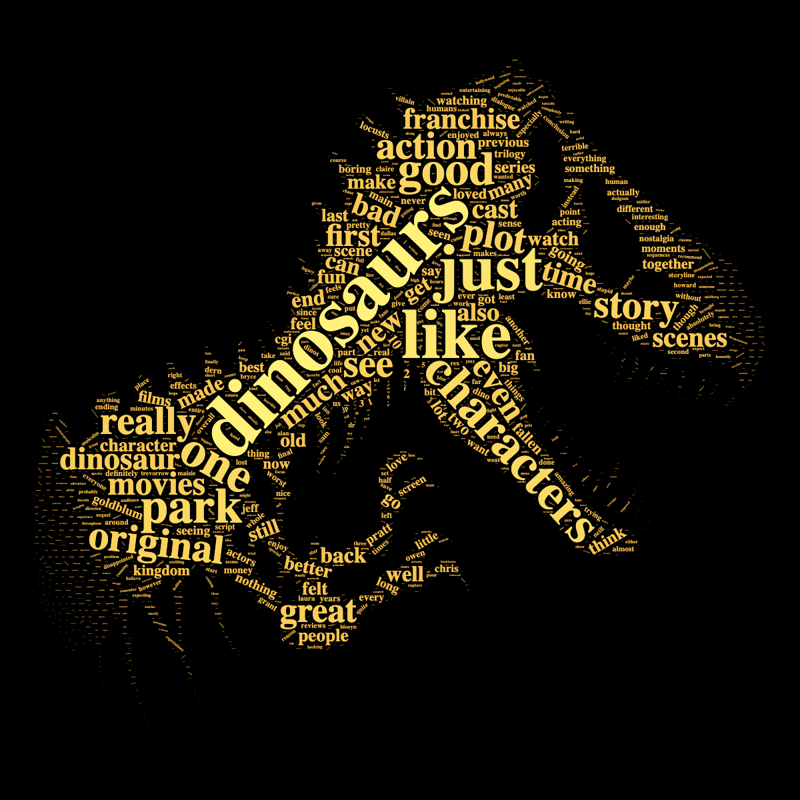

# About

This repository holds IMDb user reviews of Jurassic World: Dominion.

* [Data](/data/reviews.csv)
* [Code](/src)

I saw Jurassic Park: Dominion, and I thought it was bad -- really bad. I wondered what others had said about it on IMDb, then I wondered if I could scrape it and do some sentiment analysis. I scraped the reviews with python and processed the data in R.
